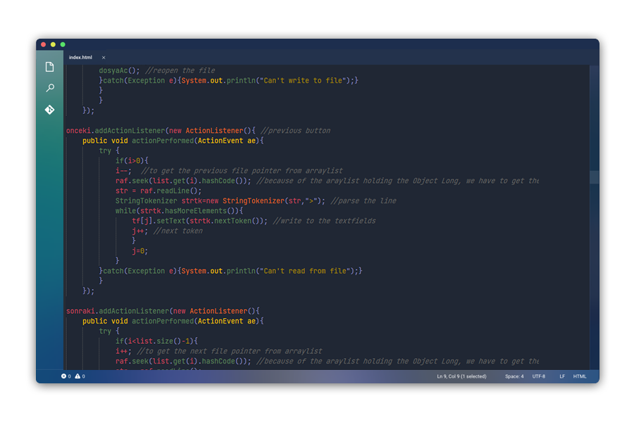

## Lotus - a dark [Visual Studio Code](https://code.visualstudio.com) theme

### Free Font used - [JetBrains Mono](https://www.jetbrains.com/lp/mono/)

## Install using [VSCode Marketplace](https://marketplace.visualstudio.com/items?itemName=Yoko-Luxelego.lotus)

1. Enter [VSCode Marketplace](https://marketplace.visualstudio.com/items?itemName=Yoko-Luxelego.lotus)
2. Search for `Lotus Theme` by Yoko

You can easily install the **Lotus Theme** by using the **Command Palette**:

1. Go to View -> `Command Palette`
2. Enter `Install Extension`
3. Write `Lotus Theme`
4. Select it or press Enter to install

## Activating the Lotus Theme

1. Click the `gear button` in the lower left corner.
2. Click `Color Theme`.
3. Select **Lotus Theme** in the list.

## Usage license

This work is licensed under a [MIT license](https://github.com/luxelego/lotus_vscode_theme/blob/main/LICENSE).
